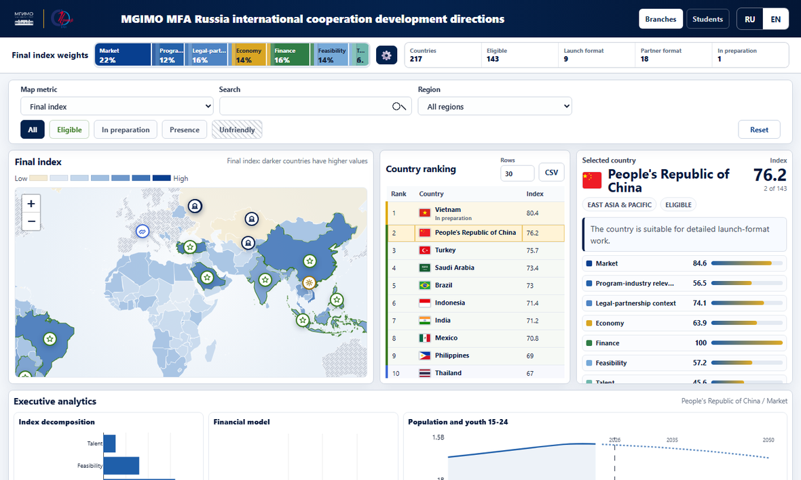
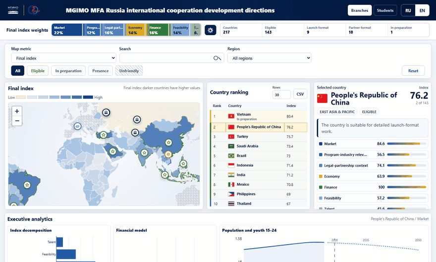
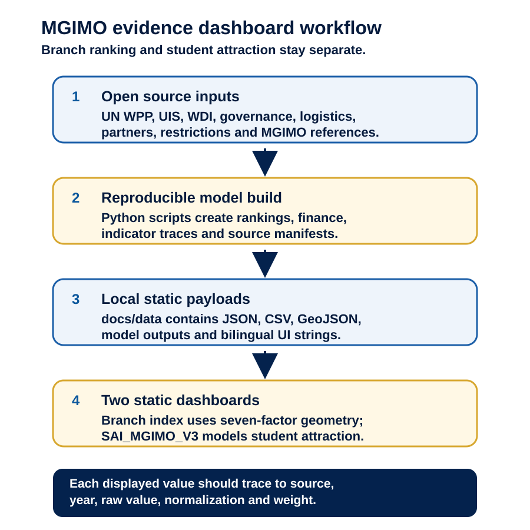
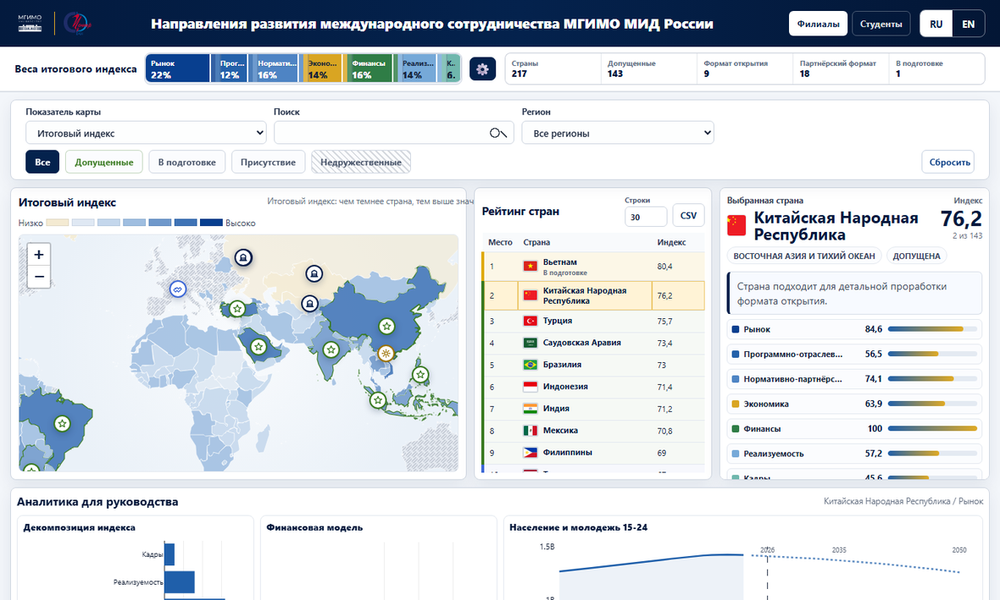
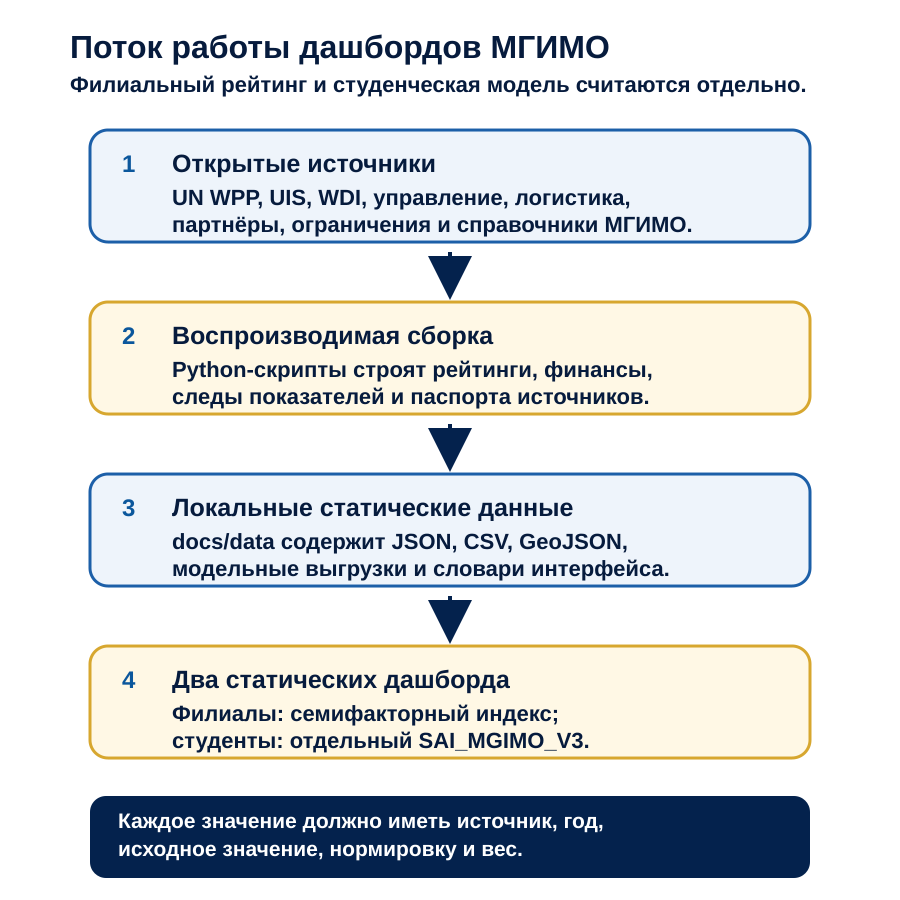

# MGIMO branch ranker

[English](#english) | [Русский](#русский)

<a id="english"></a>
## English

**Live dashboards:** [branch ranking](https://arseniy24rus.github.io/MGIMO-branch-ranker/) and [student attraction](https://arseniy24rus.github.io/MGIMO-branch-ranker/students.html)


*English branch-ranking dashboard with the country map, ranking table and selected-country evidence card.*

### Capabilities And Scenario

This repository contains a static executive dashboard for prioritizing countries for prospective MGIMO MFA Russia foreign branches, plus a separate dashboard for international student attraction to MGIMO in Moscow. The audience is a strategy group that needs to compare countries, challenge weights, inspect source evidence and distinguish a branch-location opportunity from a student-recruitment opportunity. The tool supports discussion; it does not replace legal, diplomatic, partner, city or financial due diligence for a concrete site. That boundary is stated in [docs/METHODOLOGY.md](docs/METHODOLOGY.md).

The branch dashboard at [docs/index.html](docs/index.html) ranks 217 country rows, with 143 currently eligible under the hard filters in the prepared payload. It combines seven factors: market attractiveness, program-industry relevance, legal-partnership context, economic context, financial feasibility, operational feasibility and strategic talent fit. Users can change factor weights in the browser; the map, ranking, selected-country profile, charts and decomposition recalculate immediately, while base recommendation categories remain the prepared model classification. Vietnam remains visible with status `In preparation`; the methodology notes that this governance status adds no bonus to the index, finance model or factor scores.


*Demo: branch ranking, weight editing and the separate student-attraction dashboard in English.*

### Data And Methodology

The student dashboard at [docs/students.html](docs/students.html) is not a copy of the branch ranking. It uses the separate `SAI_MGIMO_V3` model documented in [docs/METHODOLOGY_STUDENT_ATTRACTION_RU.md](docs/METHODOLOGY_STUDENT_ATTRACTION_RU.md): youth opportunity, UIS outbound mobility, legal-partnership context, program relevance, affordability, digital reach and data quality. Dashed map arcs are modelled attraction potential, not factual MGIMO student counts. Factual country-level student flows are displayed only when an open country-level source is available.

The data model is static and evidence-oriented. The main payload [docs/data/mgimo_dashboard_data.json](docs/data/mgimo_dashboard_data.json) contains countries, weights, eligibility flags, demography series, age-sex pyramids, branch markers, student attraction rows, flow layers, sources and metadata. [docs/DATA_DICTIONARY.md](docs/DATA_DICTIONARY.md) defines the public entities and user-facing metrics. Branch factor tabs read `docs/data/factor_inputs_long.json`, while `branch_factor_indicator_dictionary_v3.csv/json` records official codes, source keys, years, units, weights and observation status. Demography uses UN World Population Prospects 2024, and the student mobility component uses UNESCO DataHub UIS `uis006`, indicator `MOR.5T8.40510`.


*Open-source inputs are built into local static payloads for two separate bilingual dashboards.*

### Limitations

The dashboard is a comparative evidence layer, not an automatic site-selection system. Scores depend on public country-level indicators, prepared weights and documented hard filters; they do not include non-public partner negotiations, city-level real estate, accreditation timing, sanctions screening, embassy judgement or a branch budget. The student-attraction view is intentionally separate from the branch-ranking model, so a strong student market is evidence for recruitment work, not by itself a branch recommendation.

### Architecture

The runtime architecture is plain static web: [docs/index.html](docs/index.html), [docs/students.html](docs/students.html), vanilla JavaScript in [docs/assets/app.js](docs/assets/app.js) and [docs/assets/students.js](docs/assets/students.js), local Leaflet, Plotly and flag assets under `docs/assets/vendor`, and RU/EN strings in [docs/locales](docs/locales). The reproducible model and validators live in [src](src), [scripts](scripts), [configs](configs) and [tests](tests). GitHub Actions validates inputs, Python tests and Playwright acceptance tests before deploying [docs](docs) through [.github/workflows/pages.yml](.github/workflows/pages.yml); an additional v3 quality gate is in [.github/workflows/v3_quality_gate.yml](.github/workflows/v3_quality_gate.yml).

### Local Use

Run locally:

```bash
npm ci
npm run start
```

Default local URL: `http://127.0.0.1:4173/`.

<details>
<summary>Full QA commands and repository structure</summary>

```bash
npm ci
npx playwright install --with-deps
python -m pip install --upgrade pip
python -m pip install -r requirements.txt
python src/validate_dashboard_inputs.py
python scripts/validate_demography_v3.py
python scripts/dashboard_review_score.py
python -m pytest -q
npx playwright test
npm run qa
```

```text
docs/index.html                         branch ranking dashboard
docs/students.html                      SAI_MGIMO_V3 student attraction dashboard
docs/assets/app.js                      branch dashboard state, map, charts, evidence, exports
docs/assets/students.js                 student dashboard state, map, charts, exports
docs/locales/                           RU/EN UI strings
docs/data/                              static payloads, traces, model outputs, references, GeoJSON
configs/                                model configuration
src/                                    reproducible ranking package and validators
scripts/                                data/model build, review and quality scripts
tests/                                  pytest and Playwright tests
```

</details>

Licensing is declared in [LICENSE](LICENSE): code is MIT; data, documentation and dashboard text are CC BY 4.0 unless upstream source terms require otherwise; external source data remain under their providers' terms.

<a id="русский"></a>
## Русский

**Живые дашборды:** [рейтинг филиалов](https://arseniy24rus.github.io/MGIMO-branch-ranker/) и [привлечение студентов](https://arseniy24rus.github.io/MGIMO-branch-ranker/students.html)


*Русский дашборд филиалов: карта стран, рейтинг и доказательная карточка выбранной страны.*

### Возможности и сценарий

Репозиторий содержит статический управленческий дашборд для приоритизации стран при обсуждении возможных зарубежных филиалов МГИМО МИД России, а также отдельный дашборд привлечения иностранных студентов в МГИМО в Москве. Адресат - стратегическая группа, которой нужно сравнивать страны, менять веса, проверять доказательную базу и не смешивать филиальную возможность со студенческим набором. Инструмент поддерживает обсуждение, но не заменяет юридическую, дипломатическую, партнёрскую, городскую и финансовую проверку конкретной площадки; это зафиксировано в [docs/METHODOLOGY_RU.md](docs/METHODOLOGY_RU.md).

Дашборд филиалов в [docs/index.html](docs/index.html) ранжирует 217 страновых строк, из которых 143 сейчас проходят жёсткие фильтры подготовленного набора данных. Индекс строится из семи факторов: рыночный потенциал, программно-отраслевая релевантность, нормативно-партнёрский контекст, экономика, финансы, операционная реализуемость и кадрово-стратегическая значимость. Пользователь может менять веса факторов прямо в браузере; карта, рейтинг, карточка страны, графики и декомпозиция пересчитываются сразу, а категории рекомендаций остаются базовой классификацией модели. Вьетнам виден в общем рейтинге со статусом `В подготовке`, но этот статус не даёт бонуса индексу, финансовой модели или отдельным факторам.


*Демо: рейтинг филиалов, изменение весов и отдельный дашборд привлечения студентов на русском языке.*

### Данные и методика

Студенческий дашборд в [docs/students.html](docs/students.html) не является копией филиального рейтинга. Он использует отдельную модель `SAI_MGIMO_V3`, описанную в [docs/METHODOLOGY_STUDENT_ATTRACTION_RU.md](docs/METHODOLOGY_STUDENT_ATTRACTION_RU.md): молодёжная возможность, исходящая мобильность UIS, нормативно-партнёрский контекст, программная релевантность, доступность, цифровой охват и качество данных. Пунктирные дуги на карте показывают модельный потенциал привлечения, а не фактическое число студентов МГИМО. Фактические страновые потоки показываются только при наличии открытого странового источника.

Модель данных статическая и доказательная. Основной файл [docs/data/mgimo_dashboard_data.json](docs/data/mgimo_dashboard_data.json) содержит страны, веса, флаги допуска, демографические ряды, возрастно-половые пирамиды, маркеры филиалов, строки студенческой модели, слои потоков, источники и метаданные. [docs/DATA_DICTIONARY.md](docs/DATA_DICTIONARY.md) описывает публичные сущности и пользовательские метрики. Вкладки факторов читают `docs/data/factor_inputs_long.json`, а `branch_factor_indicator_dictionary_v3.csv/json` фиксирует официальные коды, ключи источников, годы, единицы измерения, веса и статус наблюдения. Демография берётся из UN World Population Prospects 2024, а компонент мобильности студентов - из UNESCO DataHub UIS `uis006`, показатель `MOR.5T8.40510`.


*Схема: открытые источники собираются в локальные статические данные для двух отдельных дашбордов.*

### Ограничения

Дашборд является сравнительным доказательным слоем, а не автоматическим выбором площадки. Оценки зависят от открытых страновых показателей, подготовленных весов и описанных жёстких фильтров; они не учитывают непубличные переговоры с партнёрами, городскую недвижимость, сроки аккредитации, санкционный контроль, суждение посольств и бюджет конкретного филиала. Студенческий дашборд намеренно отделён от филиальной модели: сильный рынок для набора студентов является аргументом для приёмной работы, но сам по себе не означает рекомендацию открывать филиал.

### Архитектура

Архитектура открываемой в браузере части - обычная статическая веб-сборка: [docs/index.html](docs/index.html), [docs/students.html](docs/students.html), JavaScript в [docs/assets/app.js](docs/assets/app.js) и [docs/assets/students.js](docs/assets/students.js), локальные Leaflet, Plotly и флаги в `docs/assets/vendor`, русские и английские строки в [docs/locales](docs/locales). Воспроизводимая модель и валидаторы находятся в [src](src), [scripts](scripts), [configs](configs) и [tests](tests). GitHub Actions проверяет входные данные, Python-тесты и сценарии Playwright перед публикацией [docs](docs) через [.github/workflows/pages.yml](.github/workflows/pages.yml); дополнительный контроль качества v3 лежит в [.github/workflows/v3_quality_gate.yml](.github/workflows/v3_quality_gate.yml).

### Локальный запуск

Локальный запуск:

```bash
npm ci
npm run start
```

URL по умолчанию: `http://127.0.0.1:4173/`.

<details>
<summary>Полные команды проверки и структура репозитория</summary>

```bash
npm ci
npx playwright install --with-deps
python -m pip install --upgrade pip
python -m pip install -r requirements.txt
python src/validate_dashboard_inputs.py
python scripts/validate_demography_v3.py
python scripts/dashboard_review_score.py
python -m pytest -q
npx playwright test
npm run qa
```

```text
docs/index.html                         дашборд рейтинга филиалов
docs/students.html                      SAI_MGIMO_V3 дашборд привлечения студентов
docs/assets/app.js                      состояние, карта, графики, доказательная таблица и выгрузки
docs/assets/students.js                 состояние, карта, графики и выгрузки студенческого дашборда
docs/locales/                           RU/EN строки интерфейса
docs/data/                              статические данные, следы расчётов, выгрузки модели, справочники, GeoJSON
configs/                                конфигурация модели
src/                                    воспроизводимый ranking package и валидаторы
scripts/                                сборка данных и модели, обзор качества, служебные проверки
tests/                                  pytest и сценарии Playwright
```

</details>

Лицензирование описано в [LICENSE](LICENSE): код распространяется под MIT; данные, документация и тексты дашборда - CC BY 4.0, если условия исходных поставщиков не требуют иного; внешние исходные данные остаются под условиями своих провайдеров.
